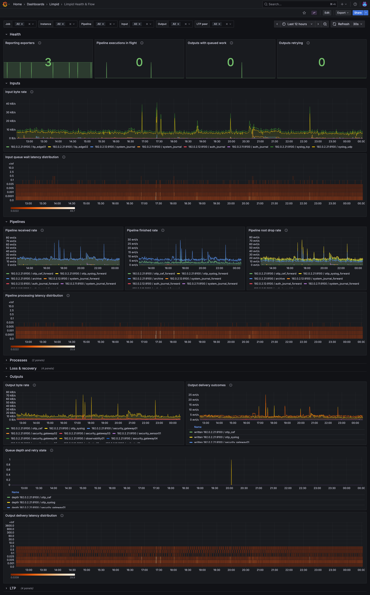

# limpid

[](https://github.com/naoto256/limpid/actions/workflows/ci.yml)
[](https://github.com/naoto256/limpid/actions/workflows/release.yml)
[](https://github.com/naoto256/limpid/releases/latest)
[](https://deps.rs/repo/github/naoto256/limpid)
[](#license)

**Log pipelines, limpid as intent.**

- *Found out what your pipeline dropped only because the destination's dashboard went quiet?*
- *Paged at 3 a.m. because a config typo crashed the daemon — and there's no rollback?*
- *Waiting weeks on a plugin release because a vendor added a field?*

limpid is for you.

It is a log pipeline daemon where most of the work is *picking which pieces to use*.

Suppose you want to ship FortiGate firewall logs to a security data lake in OCSF format. With limpid, that is just chaining a handful of named pieces:

```limpid
def pipeline fortigate_to_security_lake {
    input   fortigate_syslog
    process parse_syslog | parse_cef | parse_fortigate_cef | compose_ocsf | ocsf_to_egress
    output  security_lake
}
```

The flow is right there in the config. Bytes arrive on `fortigate_syslog`; `parse_syslog` unwraps the syslog transport into `workspace.syslog.*`; `parse_cef` decodes the CEF format from the syslog body into `workspace.cef.*`; `parse_fortigate_cef` interprets the FortiGate dialect and writes structured facts into `workspace.lsis.parsed.*` (the LSIS facts layer); `compose_ocsf` dispatches on `workspace.lsis.parsed.class_uid` and emits the matching OCSF JSON to `workspace.lsis.composed.ocsf`; the companion `ocsf_to_egress` hands that slot off to `egress` and the result leaves through `security_lake`. No hidden behavior. No plugin to install. No separate "transform" config.

In limpid, anything you want to do to a log on its way from input to output is achieved by freely combining `process`es.

## So what is a `process`?

A reusable chunk of pipeline logic — small, named, drop-in. You write them yourself, or you include them from the snippet library (a curated collection introduced in **v0.7.0** and expanded across the 0.7.x line: 32 parser files (29 source / vocabulary parsers plus 3 transport / format parsers), 31 sibling per-source OTLP adapters, the OCSF 1.3.0 27-class composer, an OTLP envelope composer, and shared helper functions; full list — machine-generated from snippet headers — in [Snippet Library](packaging/snippets/README.md)). Here is what an OCSF Detection Finding composer leaf looks like under the hood:

```limpid
def process compose_ocsf_detection_finding {
    process validate_ocsf_severity_number
    let activity = workspace.lsis.parsed.activity_id
    workspace.lsis.composed.ocsf = to_json(null_omit({
        class_uid:    2004,                     // Detection Finding
        category_uid: 2,                        // Findings
        activity_id:  activity,
        type_uid:     2004 * 100 + activity,
        time:         timestamp_ns_to_ms(coalesce(workspace.lsis.parsed.time, received_at)),
        severity_id:  compose_ocsf_severity_id(
            workspace.lsis.parsed.severity_number,
            null,                               // legacy compatibility slot
            workspace.lsis.parsed.severity
        ),
        severity:     workspace.lsis.parsed.severity,
        // ...
    }))
}
// Companion one-line process `ocsf_to_egress` (in the same file)
// moves the composed slot to `egress` — the egress single-writer
// invariant. See packaging/snippets/README.md § Slot registry — composed layer.
```

Each `def process` is one small responsibility — parse one vendor, shape one schema, drop one class of events. A pipeline is a chain of them, separated by `|`, written in the same DSL whether you authored the piece yourself or pulled it from the library.

The day you need to ship Cisco ASA logs to the same destination, you include the bundled `parse_asa` and reuse `compose_ocsf` unchanged. The day you want to drop debug-level events before they leave, you slot in a `drop_debug` ahead of the chain. The day a vendor adds a field, you edit the parser snippet and `SIGHUP`. Each change is a swap, an insertion, or an edit on one named piece — never a rewrite of the whole pipeline.

## Why this is different

A few we have already covered:

- **Composable pieces.** Pipelines are chains of small named processes — `parse_cef | parse_fortigate_cef | compose_ocsf | route_by_severity`. Each piece is one responsibility, swappable, and reusable across pipelines.

- **Durable recovery sink, built in.** `control { error_log "..." }` persists payloads that retry-exhaust or fail the shutdown flush — operators get the recovery guarantee without writing their own DLQ wiring. `--check --strict-warnings` enforces it on configs that need it.

- **Visible flow.** Read the config and you know what the pipeline does. No implicit parsers that fire because input "looks like JSON". No magic defaults. No plugin runtime layer that translates between versions.

- **Vendor parsers in your hands.** Vendor-specific logic (CEF parsing, FortiGate quirks, OCSF schema mapping) lives in `.limpid` snippets you edit on your timeline. A vendor adds a field — you fix it in one file and `SIGHUP`. No Ruby plugin ABI, no Rust recompile, no waiting on the daemon team.

And here is the half that should make you grin — daily operations the alternatives simply cannot match, the kind of thing that changes how you live with a log pipeline:

- **You can watch the pipeline work, live.** `limpidctl tap output security_lake --json` streams events as they leave for the destination (source, ingress, egress bytes). `limpidctl tap process compose_ocsf --json` shows the workspace state at that pipeline hop. No pause, no traffic duplication, no second tool. Every pipeline is its own debugger.

  ```text
  $ limpidctl tap process compose_ocsf --json | jq -c '{src: .source, sev: .workspace.lsis.parsed.severity_number, class: .workspace.lsis.parsed.class_uid}'
  {"src":{"ip":"10.0.0.21","port":51234},"sev":17,"class":2004}
  {"src":{"ip":"10.0.0.21","port":51234},"sev":21,"class":2004}
  {"src":{"ip":"10.0.0.22","port":42100},"sev":13,"class":2004}
  ...
  ```

- **Edit. Save. Reload. Mistake? It rolls back.** `SIGHUP` validates the new config first. A typo, an unknown identifier, a missing include — the daemon refuses the new config, prints a diagnostic, keeps the existing runtime intact. A *valid* reload tears down the old runtime and rebinds — brief downtime for *new* connections; the old runtime drains established TCP/HTTP/gRPC connections and disk queues persist across the cycle (memory queues and in-flight events are best-effort drained). Iterating on production pipelines stops being scary.

- **Yesterday's traffic, today's config.** Capture an hour of real events with `limpidctl tap output <name> --json`; edit the pipeline; replay through `limpidctl inject input <name> --json`. Pipeline changes get validated against actual production shapes — not synthetic fixtures, not staging that drifted six months ago.

- **Mistyped a function name?** `limpid --check --ultra-strict` catches it before the daemon starts: rustc-style diagnostic, line and column, *"did you mean `parse_json`?"*. No "deploy and find out". No 3am page from a config typo that compiled fine and silently dropped half the events.

  ```text
  $ limpid --check --ultra-strict --config /etc/limpid/limpid.conf
  error[dataflow]: [pipeline main] call to unknown function `parse_jsn`
    --> /etc/limpid/limpid.conf:11:24
     |
  11 |     workspace.parsed = parse_jsn(ingress)
     |                        ^^^^^^^^^^^^^^^^^^
     = help: did you mean `parse_json`?
  error: /etc/limpid/limpid.conf: 1 error(s) found
  ```

These come from [five design principles](docs/src/design-principles.md) — *zero hidden behavior*, *I/O is dumb transport*, *only `egress` crosses hops*, *atomic events through the pipeline*, and *safety and operational transparency* — that are stated, defended, and held in place by the analyzer.

## Quick start

```bash
cargo build --release -p limpid -p limpidctl -p limpid-prometheus

limpid --check --config /etc/limpid/limpid.conf     # static analysis
limpid --config /etc/limpid/limpid.conf             # run the daemon
```

Optional feature-gated modules (require system libs):

```bash
cargo build --release -p limpid --features journal    # systemd journal input; needs libsystemd-dev
cargo build --release -p limpid --features kafka      # kafka output; needs libsasl2-dev / librdkafka build deps
cargo build --release -p limpid --features journal,kafka
```

Other useful flags during config development:

- `--check --strict-warnings` — promote analyzer warnings to errors (for example, missing `control { error_log }` on configs that depend on recovery).
- `--check --ultra-strict` — promote unknown-identifier warnings to errors. This is the only opt-in lint upgrade today; it is *not* a generic style-level fail-on-warn. For "any warning fails CI" use `--strict-warnings`.
- `--graph[=mermaid|dot|ascii]` — render the resolved pipeline graph for review or for pasting into a PR description.
- `--test-pipeline <name> --input '<json>'` — run a single Event through one named pipeline without binding any sockets.

See the [Getting Started guide](docs/src/getting-started.md) for installation, .deb packaging, and systemd integration.

## What's in the box

### Inputs

`syslog_udp` · `syslog_tcp` (with optional TLS / mTLS) · `tail` · `journal`&nbsp;\* · `unix_socket` · `otlp_http` · `otlp_grpc`

### Outputs

`syslog_udp` · `syslog_tcp` (with optional per-peer TLS / mTLS) · `file` · `http` (with per-peer TLS / mTLS, round-robin across peers) · `kafka`&nbsp;\* (with optional TLS / mTLS / SASL) · `unix_socket` · `stdout` · `otlp_http` / `otlp_grpc` (with per-peer TLS / mTLS, round-robin across peers)

\* `journal` and `kafka` are feature-gated — build with `--features journal` / `--features kafka` (see [Quick start](#quick-start)).

### Snippets

Curated parser / composer / filter library, installed under `/usr/share/limpid/snippets/` and `include`-able by absolute path. Introduced in **v0.7.0**, with the transport layer split out as its own snippet category in **v0.7.1** and the vendor lineup expanded across the 0.7.x line:

- **Transport / format parsers (3)** — `parse_syslog` (RFC 3164 / 5424 syslog wire, v0.7.1) · `parse_journald` (systemd journald JSON, v0.7.1) · `parse_cef` (ArcSight CEF format from a syslog body, with a generic `cef_to_otlp` adapter). These populate `workspace.<layer>.*` and feed any vocabulary parser downstream — vendor CEF parsers chain as `parse_syslog | parse_cef | parse_<vendor>_cef`.
- **Source / vocabulary parsers (29)** — security devices / cloud audit: `parse_fortigate_cef` · `parse_fortigate_syslog` · `parse_paloalto_cef` · `parse_paloalto_syslog` · `parse_asa` · `parse_cloudtrail` · `parse_juniper_srx_sd_syslog` (Junos structured-data) · `parse_juniper_srx_syslog` (Junos unstructured RT_IDP) · `parse_checkpoint_leef` (LEEF 2.0 / QRadar) · `parse_checkpoint_syslog` (Check Point Syslog Exporter) · `parse_nsp` (Trellix Network Security Platform). OSS NDR: `parse_suricata` (EVE JSON) · `parse_zeek_default` / `parse_zeek_soc` / `parse_zeek_full` (Zeek 8 / 20 / 43 protocol scripts, nested-superset scopes, with `_native` / `_flat` convenience variants for raw Zeek vs Filebeat-flat upstream). Cloud (audit / data-plane / findings / identity / orchestration): `parse_aws_guardduty` · `parse_aws_vpc_flow` · `parse_azure_activity` · `parse_k8s_audit` · `parse_okta_system`. Server / host vocabulary: `parse_openssh` · `parse_sudo` · `parse_combined_log` (Apache / Nginx) · `parse_postfix` · `parse_winevent_json` · `parse_sysmon` · `parse_bind` · `parse_auditd` (7 LSIS classes). Vendor-neutral: `parse_ocsf`.
- **Composers (4)** — `compose_ocsf` (OCSF 1.3.0 priority set, 27 classes, dispatched by `workspace.lsis.parsed.class_uid`) · `compose_rfc5424` (generic RFC 5424 record composer with a `journald_to_rfc5424` bridge for edge → syslog-relay use, v0.7.1) · `compose_replayable` (replay-shape capture) · `compose_otlp` (assembles OTLP 1.0.0 `ResourceLogs` proto bytes from 31 parser-owned source adapters, ten optional shed slots, and canonical parsed time/severity). Composers write to `workspace.lsis.composed.<slot>`; a companion `<slot>_to_egress` one-line process (shipped alongside each composer) moves the slot to `egress` under the egress single-writer invariant.
- **Filters (1)** — `filter_openssh_journal` (drops PAM session double-count noise from journald sshd streams).

Each parser writes facts to `workspace.lsis.parsed.*` (the LSIS facts layer — the Limpid Snippet Intermediate Schema, a three-layer gentleman's agreement documented in the [pack snippet README](packaging/snippets/README.md#lsis--the-limpid-snippet-intermediate-schema)); `compose_ocsf` reads from it and emits OCSF JSON to `workspace.lsis.composed.ocsf`, and the companion `ocsf_to_egress` hands the slot off to `egress`. Two `include` lines + a two-stage pipeline gets vendor logs into a SIEM / data lake in OCSF form. Full reference: [Snippet Library](packaging/snippets/README.md).

### Functions

There are several types of expression functions you can call from inside a `process` body:

- **Generic parsers** — `parse_json` · `parse_kv` · `csv_parse` · `nest_dotted_keys` (lift flat dotted keys from Zeek / Filebeat-style inputs into a nested object)
- **Regex** — `regex_match` · `regex_extract` · `regex_parse` · `regex_replace`
- **String predicates** — `contains` · `starts_with` · `ends_with`
- **String manipulation** — `lower` · `upper` · `strftime` · `strptime`
- **Datetime parsers** — `parse_datetime_rfc3339` · `parse_datetime_rfc2822`
- **Type coercion** — `to_int` · `to_json` · `to_bytes` · `to_string`
- **Fallback / shaping** — `coalesce` · `null_omit`
- **Collections** — `map` · `filter` · `find` · `reduce` · `first` · `last` · `concat` · `distinct` · `sum` · `max` · `min` · `entitle` · `path` · `append` · `prepend` · `len` · `is_array`
- **Hashing** — `md5` · `sha1` · `sha256`
- **Tables / enrichment** — `table_lookup` · `table_upsert` · `table_delete` · `geoip`
- **Environment** — `hostname` · `version` · `timestamp`
- **Syslog** — `syslog.parse` · `syslog.strip_pri` · `syslog.set_pri` · `syslog.extract_pri`
- **CEF** — `cef.parse`
- **OTLP** — `otlp.encode_resourcelog_protobuf` · `otlp.decode_resourcelog_protobuf` · `otlp.encode_resourcelog_json` · `otlp.decode_resourcelog_json`

Full reference: [Built-in Functions](docs/src/functions/expression-functions.md) · [String interpolation](docs/src/dsl-syntax.md#string-interpolation).

## Observability

limpid exports bounded-cardinality metrics for each configured input, pipeline,
process, and output. The bundled Grafana dashboard brings health, flow,
recovery, and stage-specific latency into one operational view.

<a href="docs/src/operations/metrics.md#import-the-dashboard-and-alert-rules">
  
</a>

See [Metrics](docs/src/operations/metrics.md) for metric definitions, Prometheus
setup, dashboard provisioning, and alert rules.

## Performance

A single core handles **~221k events/sec** on the heaviest realistic schema-shaping DSL workload — full OCSF Authentication compose with `to_json` serialization, single-pipeline single-input, channel-direct injection. Lighter shapes scale up from there:

| Pipeline shape | events/sec/core |
| --- | ---: |
| passthrough | 378k |
| `syslog.parse(ingress)` | 380k |
| OCSF compose + to_json (heaviest realistic schema-shaping) | 221k |
| **parse + 2× regex + if/else (heaviest per event)** | **146k** |

Multi-pipeline configurations scale across cores via Tokio's multi-thread runtime: 4 independent pipelines (each its own input, process chain, and output) reach ~581k events/sec aggregate on the OCSF compose workload on a 16-core host, with no application-level work-stealing or pinning.

The single-core numbers above are v0.7.10 measurements. The path to today's numbers ran through the v0.6.0 perf milestone (per-event bump arena, direct `serde::Serialize` for the runtime `Value` tree, static-literal hash-key interning, and a boundary refactor that eliminated the hot-path `BorrowedEvent::to_owned()` at every output sink), the v0.6.1 follow-up (per-worker bump-arena recycling, lifting the macOS `xzm` zone-lock contention that capped multi-pipeline scaling), and the v0.7.10 queue-consumer wake mitigation (batch-drain via `recv_many` plus an adaptive spin-before-park controller) that closed a wake-amplification tail on populated-workspace workloads. Real I/O (`__sendto`) and tokio scheduling are now the dominant categories on the flame graph; allocation collapsed from 43% at v0.5.7 to 15% on the single-pipeline path. See the [CHANGELOG](CHANGELOG.md) for the cumulative breakdown.

## Compared to rsyslog / fluentd / Vector

A capability snapshot versus the established log forwarders. Where a cell says "—" the capability is absent; where it says something else, that is roughly how that tool addresses the same axis.

| Capability | rsyslog | fluentd | Vector | **limpid** |
| --- | --- | --- | --- | --- |
| **Pre-deploy config check** | `rsyslogd -N1` (syntax) | `fluentd --dry-run` (config parse) | `vector validate` | rustc-style type + dataflow checker |
| **Live event tap (any hop)** | — | — | `vector tap` | `limpidctl tap` |
| **Replay captured traffic** | — | — | — | `limpidctl inject` |
| **Hot reload safety** | SIGHUP, no rollback | SIGHUP, fragile | SIGHUP, validates first | SIGHUP atomic, rollback on failure |
| **Vendor parsers** | C modules | Ruby plugins | DSL transforms (VRL) | DSL snippets (`include`-able) |
| **OTLP first-class** | — | plugin | yes | yes (input + output, 3 transports) |
| **Runtime** | C | Ruby + C | Rust | Rust |

The point is not that the alternatives are bad — they have decades of hardened, large-scale deployment behind them. The point is that limpid is built for a different default: pipelines that are *legible*, *verifiable*, and *operable* without a second tool.

## Upgrading

Before upgrading, review the target version in [`CHANGELOG.md`](CHANGELOG.md);
pre-1.0 releases may change DSL and snippet contracts. For package installation
and service reload procedures, see [Packaging](docs/src/operations/packaging.md#upgrading).

## Documentation

- [Introduction](docs/src/introduction.md) · [Design Principles](docs/src/design-principles.md)
- [Getting Started](docs/src/getting-started.md) · [Configuration](docs/src/configuration.md)
- [Inputs](docs/src/inputs/README.md) · [Outputs](docs/src/outputs/README.md) · [Processing](docs/src/processing/README.md)
- [Process Design Guide](docs/src/processing/design-guide.md) · [User-defined Processes](docs/src/processing/user-defined.md)
- [Functions](docs/src/functions/README.md) · [Built-in Functions](docs/src/functions/expression-functions.md) · [User-defined Functions](docs/src/functions/user-defined.md)
- [Pipelines](docs/src/pipelines/README.md) · [Routing](docs/src/pipelines/routing.md) · [`drop`, `finish`, and `error`](docs/src/pipelines/drop-finish-error.md) · [Examples](docs/src/pipelines/examples.md) · [Multi-host Pipeline Example](docs/src/pipelines/multi-host.md)
- [CLI](docs/src/operations/cli.md) · [Debug Tap](docs/src/operations/tap.md) · [Error Log (DLQ)](docs/src/operations/error-log.md) · [Schema Validation](docs/src/operations/schema-validation.md) · [Metrics](docs/src/operations/metrics.md) · [Packaging](docs/src/operations/packaging.md) · [systemd](docs/src/operations/systemd.md)
- [OTLP — design rationale](docs/src/otlp.md)
- [Migrating from rsyslog](docs/src/operations/migration.md)

## License

Licensed under either of [MIT](LICENSE-MIT) or [Apache-2.0](LICENSE-APACHE) at your option.
